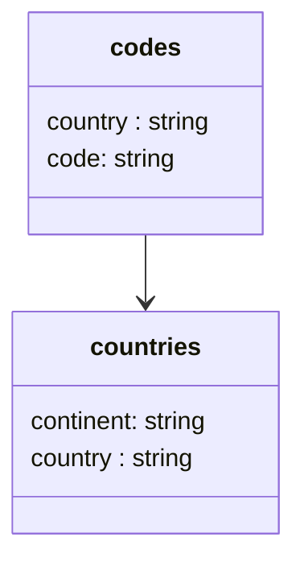

'## Example database

```mermaid
classDiagram
class countries {
continent: string
country : string
}
class codes {
country : string
code: string
}
codes --< countries
```
## Tables
### Table countries
|continent | country |
|--|--|
|Europe  | Netherlands |
### Table Code

<!--stackedit_data:
eyJoaXN0b3J5IjpbNzIxMzcyODUxLDg5ODA2OTk2MF19
-->