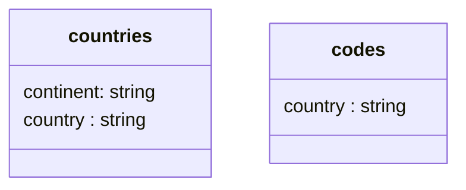

## Example database

```mermaid
classDiagram
class countries {
continent: string
country : string
}
class codes {
country : string

}
```
<!--stackedit_data:
eyJoaXN0b3J5IjpbMTMyNzc3NDE2NCwtMzMyNDU1MzYzXX0=
-->