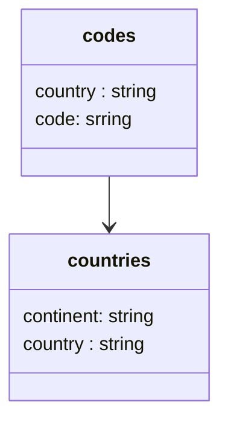

## Example database

```mermaid
classDiagram
class countries {
continent: string
country : string
}
class codes {
country : string
code: srring
}
codes --< countries
```
## Tables
```
<!--stackedit_data:
eyJoaXN0b3J5IjpbLTg3ODY2MTg3MywtMzMyNDU1MzYzXX0=
-->